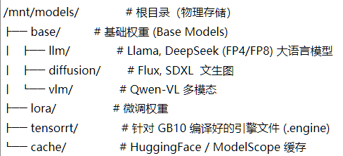

# 🚀  AI 推理模型中心化管理助手 (iMap-Helper)

这是一个模型存储治理工具。它通过“中心化存储 + 逻辑映射”的方案，解决了多用户环境下模型重复下载、系统盘空间爆满以及 Docker 容器路径挂载繁琐等痛点。

简单使用: 规划模型存放路径 -> 复制原始路径 -> 粘贴 -> 复制使用 (不直接运行, 而是粘贴到需要的配置文件中使用)
卸载: 脚本不直接运行 rm -rf，而是把命令打印出来。 (请自行在终端上执行删除指令)
---

## ✨ 核心特性

* **📦 统一仓储**：构建标准的目录结构，涵盖 LLM、Diffusion、VLM、LoRA 和 TensorRT。
* **🛡️ 系统盘保护**：自动重定向 HuggingFace 和 ModelScope 缓存路径到数据盘，防止 `/home` 目录溢出。
* **🔗 智能映射**：一键生成适用于 **本地 Python 环境 (软链接)** 和 **Docker 容器 (挂载参数)** 的部署指令。
* **🦾 Blackwell 优化**：专门预留 `tensorrt` 目录，用于存放针对 NVIDIA NIM 优化的 FP4/FP8 推理引擎。
* **✅ 安全加固**：初始化采用“无损修复”逻辑，不覆盖已有模型；权限自动适配多用户协作与容器访问。
* **📊 健康监控**：实时显示仓库完整性、物理树状结构及缓存占用大小。

---

## 📂 推荐目录结构

脚本将根据以下逻辑初始化你的存储空间：

```text
/mnt/models (或你的挂载点)
├── base
│   ├── llm        # 语言模型原生权重 (如 Llama 3)
│   ├── diffusion  # 绘图模型原生权重 (如 Flux, SD3)
│   └── vlm        # 多模态模型 (如 Qwen-VL)
├── lora           # 微调权重文件
├── tensorrt       # GB10 专用的 TensorRT-LLM/Engine 引擎
└── cache          # 统一的 HuggingFace / ModelScope 缓存

```

---

## 🛠️ 安装与使用

### 1. 快速安装

将脚本下载到本地并赋予执行权限：

```bash
chmod +x imaphelper.sh

```

### 2. 初始化环境

第一次使用时，请运行脚本并选择选项 **[1]**：

* **动作**：创建目录、修复权限、注入环境变量。
* **注意**：完成后请执行 `source ~/.bashrc` 使缓存重定向生效。

### 3. 生成映射指令

当需要部署模型时，选择选项 **[2]**：

1. 输入你想在代码里调用的“引用路径”（如 `/home/user/ComfyUI/models/checkpoints/flux.sft`）。
2. 选择物理分类。
3. **直接复制** 生成的 `ln -s`（本地）或 `-v`（Docker）指令。

---

## 💡 典型应用场景

### 场景 A：保护系统盘免受 HF 缓存侵害

脚本会将 `HF_HOME` 指向数据盘。

> **结果**：当你运行 `from_pretrained("model_id")` 时，几十 GB 的数据会直接进入 cache 目录。

### 场景 B：Docker 容器推理

在部署 NVIDIA NIM 或 vLLM 容器时，使用生成的方案 B 参数：

```bash
# 脚本生成的输出示例：
docker run --gpus all \
  -v "/mnt/models/base/llm/Llama3-8B":"/models/Llama3" \
  -v "/mnt/models/cache":"/root/.cache/huggingface" \
  nvidia/nim:latest

```

---

## ⚠️ 安全说明

* **数据无损**：初始化逻辑使用 `mkdir -p`，若目录已存在模型文件，**绝不会**被删除或覆盖。
* **权限位 (GID)**：脚本对目录设置了 `s` 位权限，确保不同用户、不同容器产生的新模型文件都能被属组内的成员共同读写，避免了 Linux 权限冲突。
* **卸载: 生成指令, 复制到终端执行**


---